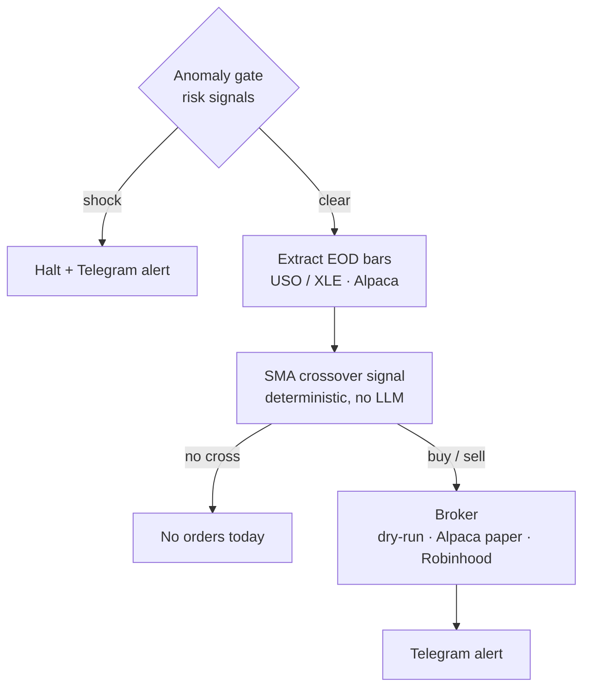
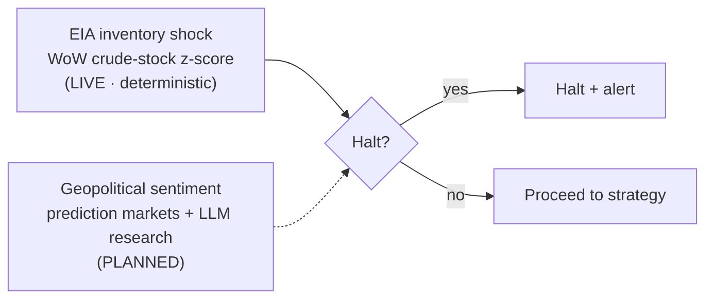
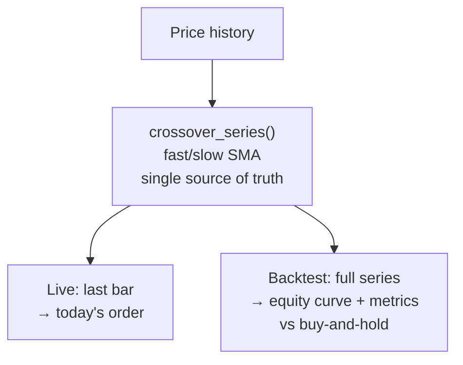
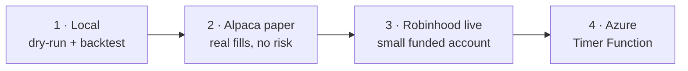

# Energy Batch Trader

An End-of-Day (EOD) energy trading pipeline. The strategy logic is **decoupled
from any orchestrator**, so the same `run_pipeline()` runs from the CLI today and
drops into Azure Functions later with no logic changes. Order execution targets
Robinhood's **official Agentic Trading MCP** — but paper-traded on Alpaca first.

## How it works

A single daily pass. The risk gate runs **first** (cheap to halt, expensive to
trade into a shock), then data → signal → execution → alert.



1. **Anomaly gate** — halts the run if a risk signal fires (see below). The only
   place an LLM is *ever* permitted, and only to stop trading — never to trade.
2. **Extract** EOD bars for the energy universe (USO/XLE) via Alpaca (synthetic
   fallback if keys are absent).
3. **Analyze** — a deterministic SMA-crossover signal produces intended orders.
   No LLM in the trade decision.
4. **Execute** — orders go to a pluggable broker (dry-run, Alpaca paper, or the
   Robinhood MCP), then a Telegram alert is sent.

## Anomaly gate (the risk gate)

The gate aggregates independent risk signals into one halt decision. Trade
decisions stay deterministic; this gate can only *stop* a run.



- **EIA inventory shock (live).** Pulls the Weekly Petroleum Status Report crude
  stocks (excl. SPR, series `WCESTUS1`) from the EIA Open Data API and halts on an
  outsized week-over-week build/draw (`|z| ≥ threshold` vs. the trailing year).
  Deterministic — no LLM. Skipped if `EIA_API_KEY` is unset.
- **Geopolitical sentiment (planned).** Prediction-market probabilities as a
  numeric trigger plus LLM web-search research for breadth and a human-readable
  halt reason. Not yet wired.

## Strategy & backtesting

The crossover rule lives in **one** function, `crossover_series()`. The live
signal is just its last bar; the backtest replays the whole series — so the
backtest can never silently drift from what trades live.



```bash
python -m energy_trader --backtest                 # 3y, USO/XLE
python -m energy_trader --backtest --years 5 --asset USO
```

Reports total return, CAGR, Sharpe, max drawdown, trade count, and win rate
against a buy-and-hold benchmark. numpy/pandas only — `vectorbt` stays an optional
research path for parameter sweeps. **Backtests need real history** (Alpaca keys);
synthetic data only proves the harness runs.

## Execution: Robinhood official Agentic Trading MCP

Live execution targets Robinhood's sanctioned **Agentic Trading** MCP at
`https://agent.robinhood.com/mcp/trading` — *not* the unofficial `robin_stocks`
private API. Why it's the right fit:

- **Sanctioned + OAuth.** You approve access in the Robinhood app; no password
  is stored. (Legacy `robin_stocks` is retained only for read-only introspection.)
- **Contained blast radius.** Trades execute only in an isolated, separately
  funded **Agentic account**; every other account stays read-only.
- **Equities/ETFs only (beta).** USO/XLE are ETFs, so this limit doesn't bite.
- **Deterministic.** We call the MCP's `review_equity_order` / `place_equity_order`
  tools directly with strategy-computed params — the LLM never places trades.

But real money comes last: the strategy is **paper-traded on Alpaca first**.

## Phased rollout



| Phase | What | Risk |
|------|------|------|
| **1 — now (local)** | `python -m energy_trader` in **dry-run** (signals, intended orders, Telegram alert) plus `--backtest` over history. You execute by hand. | none |
| **2 — Alpaca paper (next)** | Add an `AlpacaBroker` against `paper-api.alpaca.markets` to validate real fills with zero risk. *(broker to be built)* | none |
| **3 — Robinhood live** | Add `ROBINHOOD_MCP_TOKEN`, fund a *small* Agentic balance, run `--live`. | small, contained |
| **4 — Azure** | Timer-triggered Azure Function calls the same `run_pipeline()`; OAuth refresh token in Key Vault. | automated |

## Quick start (Phase 1)

```bash
python3 -m venv .venv && source .venv/bin/activate
pip install pandas numpy requests python-dotenv   # core runtime only
cp .env.example .env                              # optional: fill in keys

python -m energy_trader                # dry-run, default USO/XLE universe
python -m energy_trader -v             # debug logging
python -m energy_trader --asset USO    # custom universe
python -m energy_trader --backtest     # backtest the strategy over history
python -m energy_trader --live         # Phase 3: arms real orders (needs token)
```

Optional keys (each feature degrades gracefully if unset): `ALPACA_API_KEY` /
`ALPACA_SECRET_KEY` (real bars), `EIA_API_KEY` (inventory gate — free key),
`TELEGRAM_BOT_TOKEN` / `TELEGRAM_CHAT_ID` (alerts).

Full deps (Airflow, vectorbt, Alpaca, LLMs): `pip install -r requirements.txt`.

## Repository structure

```
energy_trader/            # framework-agnostic pipeline (the actual logic)
  pipeline.py             #   run_pipeline() — the orchestrator-agnostic entrypoint
  config.py  data.py      #   settings; Alpaca extract (+ synthetic fallback)
  anomaly.py              #   risk gate: aggregates halt signals
  eia.py                  #   EIA inventory-shock signal (deterministic)
  strategy.py             #   deterministic SMA crossover (single source of truth)
  backtest.py             #   lightweight backtest harness (--backtest)
  notify.py               #   Telegram alerts
  brokers/                #   pluggable execution
    dry_run.py            #     logs intended orders (Phase 1 default)
    robinhood_mcp.py      #     official Robinhood Agentic Trading MCP (Phase 3)
  __main__.py             #   CLI: python -m energy_trader
dags/energy_eod_dag.py    # thin Airflow DAG -> calls run_pipeline()
plugins/                  # Airflow plugins (notifications shim; legacy RH hook)
```

See `RUNBOOK.md` for operations, the MCP connector flow, and Azure deployment.
