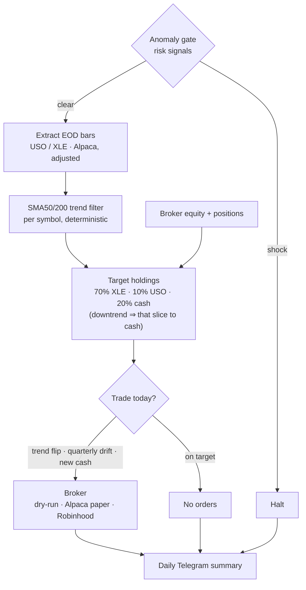
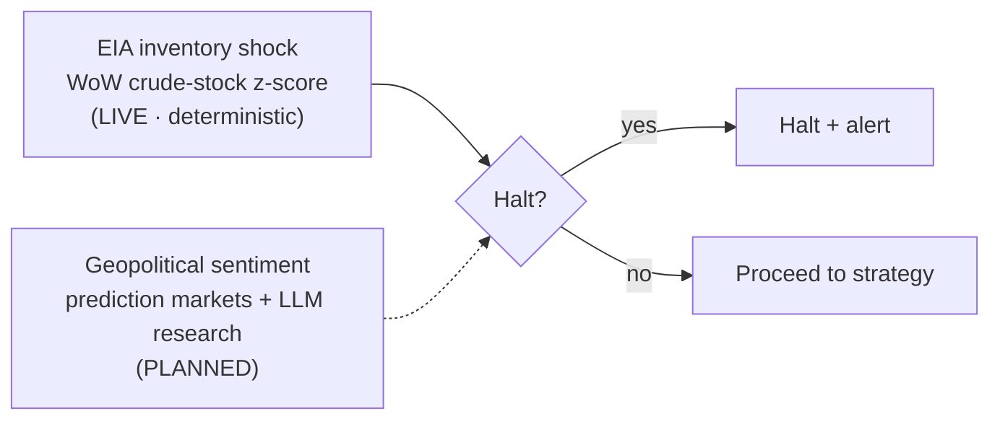
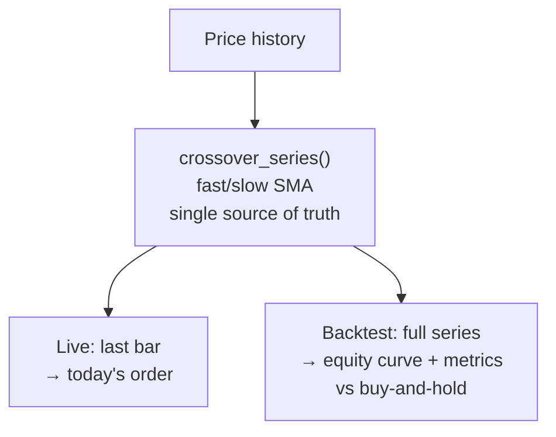
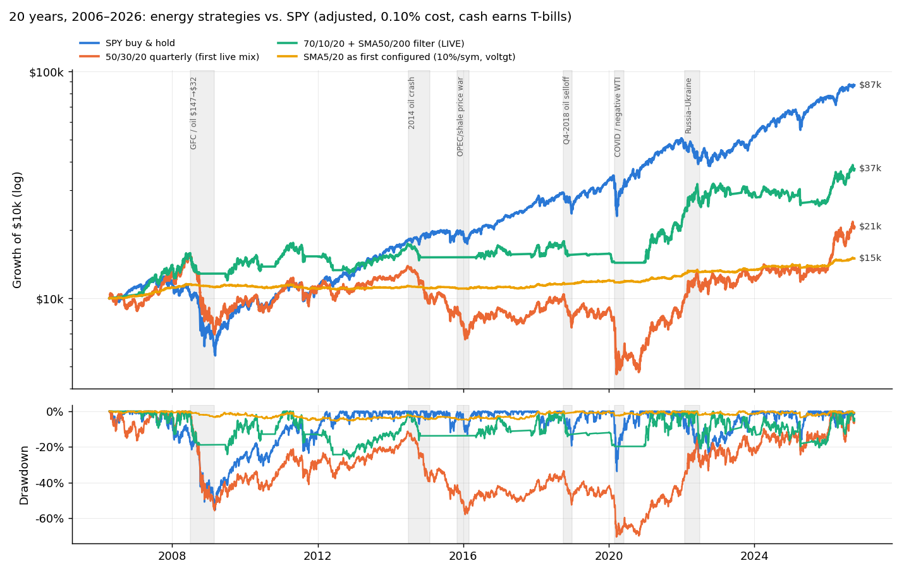
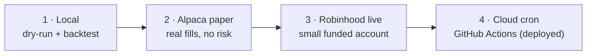

# Energy Batch Trader

An End-of-Day (EOD) energy trading pipeline. The strategy logic is **decoupled
from any orchestrator**, so the same `run_pipeline()` runs from the CLI today and
drops into Azure Functions later with no logic changes. Order execution targets
Robinhood's **official Agentic Trading MCP** — but paper-traded on Alpaca first.

> **A personal learning project, not an edge.** Built in Houston — the "energy
> capital" — to learn how energy markets actually behave by trading them
> end-to-end. The honest result: over 20 years nothing here beat holding the
> S&P 500. What I learned is in **[blog.md](blog.md)**.
>
> *Not financial advice. Paper trading by default; any live use is at your own risk.*

## How it works

A single daily pass. The risk gate runs **first** (cheap to halt, expensive to
trade into a shock), then data → signal → execution → alert.



1. **Anomaly gate** — halts the run if a risk signal fires (see below). The only
   place an LLM is *ever* permitted, and only to stop trading — never to trade.
2. **Extract** EOD bars for USO/XLE via Alpaca (adjusted). Synthetic fallback bars
   exist for a fresh checkout but **never trigger a trade**.
3. **Plan** (`allocation.py`, the default `EOD_STRATEGY=allocation`) — a strategic
   mix of **70% XLE / 10% USO / 20% cash**. A symbol whose 50-day SMA falls below
   its 200-day steps aside to cash until it crosses back. Trades only on a trend
   flip, a quarterly rebalance (days 1–7 of Jan/Apr/Jul/Oct, if >3pp off), or new
   cash (deposits, invested buy-only). Compared against the broker's *actual*
   holdings, so missed runs self-heal. No LLM in the trade decision.
4. **Execute** — orders go to a pluggable broker (dry-run, Alpaca paper, or the
   Robinhood MCP). A **daily Telegram summary** — equity, weights vs target, trend
   state, next rebalance — is sent every run, trade or not.

The original SMA(5/20) crossover with vol-targeted sizing is still available as
`EOD_STRATEGY=trend` (`rebalance.py`), now position-aware.

## Anomaly gate (the risk gate)

The gate aggregates independent risk signals into one halt decision. Trade
decisions stay deterministic; this gate can only *stop* a run.



- **EIA inventory shock (live).** Pulls the Weekly Petroleum Status Report crude
  stocks (excl. SPR, series `WCESTUS1`) from the EIA Open Data API and halts on an
  outsized week-over-week build/draw (`|z| ≥ threshold` vs. the trailing year).
  Deterministic — no LLM. Skipped if `EIA_API_KEY` is unset.
- **Geopolitical sentiment (planned).** Prediction-market probabilities as a
  numeric trigger plus LLM web-search research for breadth and a human-readable
  halt reason. Not yet wired.

## Strategy & backtesting

The crossover rule lives in **one** function, `crossover_series()`. The live
signal is just its last bar; the backtest replays the whole series — so the
backtest can never silently drift from what trades live.



```bash
python -m energy_trader --backtest                 # 3y, USO/XLE
python -m energy_trader --backtest --years 5 --asset USO
```

Reports total return, CAGR, Sharpe, max drawdown, trade count, and win rate
against a buy-and-hold benchmark. numpy/pandas only — `vectorbt` stays an optional
research path for parameter sweeps. **Backtests need real history** (Alpaca keys);
synthetic data only proves the harness runs.

`--strategy pairs` swaps in a **market-neutral spread mean-reversion** strategy
(`pairs.py`) with an Engle-Granger **cointegration gate** (`gate PASS/FAIL`) and an
OU half-life; pass 3+ assets to **sweep** every pair, ranked cointegrated-first.
When USO is in the universe (and `EIA_API_KEY` is set) the backtest also prints a
**USO roll-decay vs. WTI-spot** diagnostic (`roll.py`) — the contango/backwardation
drag. (Backtests use **split/dividend-adjusted** bars — `Adjustment.ALL` — so USO's
2020 reverse split doesn't corrupt the history.)

Two more research strategies: `--strategy carry` (`carry.py`) tests USO's
**roll-yield** as a signal against SMA + buy-and-hold, and `--strategy voltgt`
(`sizing.py`) shows SMA **before/after volatility-targeted sizing** (Kaufman ch.23)
— the drawdown-tamer now wired into live sizing. Add `--plot` to save equity,
drawdown, regime, and vol-target charts to `plots/` (energy-shock windows shaded);
`notebooks/research.ipynb` reproduces the whole analysis with inline charts.

> **Headline (20 years, 2006–2026 — `longrun.py`, notebook §5):** nothing energy-based
> beat **SPY buy-and-hold (+11%/yr)**. USO lost 98% peak-to-trough to contango roll
> decay. The first live mix (50/30/20) made +3.6%/yr with a −70% drawdown; the live
> **70/10/20 + 50/200 filter** makes +6.6%/yr with a −27% drawdown. The 10-year
> Alpaca window (2016+) flattered everything — vol-targeting's "win" there lowered
> return in every SMA pair over 20 years. Carry is a regime diagnostic, not an edge.



## Execution: Robinhood official Agentic Trading MCP

Live execution targets Robinhood's sanctioned **Agentic Trading** MCP at
`https://agent.robinhood.com/mcp/trading` — *not* the unofficial `robin_stocks`
private API. Why it's the right fit:

- **Sanctioned + OAuth.** You approve access in the Robinhood app; no password
  is stored. (Legacy `robin_stocks` is retained only for read-only introspection.)
- **Contained blast radius.** Trades execute only in an isolated, separately
  funded **Agentic account**; every other account stays read-only.
- **Equities/ETFs only (beta).** USO/XLE are ETFs, so this limit doesn't bite.
- **Deterministic.** We call the MCP's `review_equity_order` / `place_equity_order`
  tools directly with strategy-computed params — the LLM never places trades.

But real money comes last: the strategy is **paper-traded on Alpaca first**.

## Phased rollout



| Phase | What | Risk |
|------|------|------|
| **1 — now (local)** | `python -m energy_trader` in **dry-run** (signals, intended orders, Telegram alert) plus `--backtest` over history. You execute by hand. | none |
| **2 — Alpaca paper (now)** | `python -m energy_trader --paper` routes orders to Alpaca's paper account (`AlpacaPaperBroker`) — real fills, zero risk. | none |
| **3 — Robinhood live** | Add `ROBINHOOD_MCP_TOKEN`, fund a *small* Agentic balance, run `--live`. | small, contained |
| **4 — Cloud (deployed)** | **GitHub Actions** cron runs `--paper` every weekday ~6 PM ET (`.github/workflows/eod-paper.yml`, keys via repo secrets) — no server kept on. Azure Functions Timer is the serverless alternative. | automated |

## Quick start (Phase 1)

```bash
python3 -m venv .venv && source .venv/bin/activate
pip install pandas numpy requests python-dotenv   # core runtime only
cp .env.example .env                              # optional: fill in keys

python -m energy_trader                # dry-run, default USO/XLE universe
python -m energy_trader -v             # debug logging
python -m energy_trader --asset USO    # custom universe
python -m energy_trader --backtest     # backtest the strategy over history
python -m energy_trader --backtest --strategy voltgt --asset USO --plot  # vol-targeting + charts
python -m energy_trader --paper        # Phase 2: Alpaca paper trading (no real money)
python -m energy_trader --live         # Phase 3: arms real orders (needs token)
jupyter lab notebooks/research.ipynb   # research notebook (needs full deps)
```

Optional keys (each feature degrades gracefully if unset): `ALPACA_API_KEY` /
`ALPACA_SECRET_KEY` (real bars), `EIA_API_KEY` (inventory gate — free key),
`TELEGRAM_BOT_TOKEN` / `TELEGRAM_CHAT_ID` (alerts).

Full deps (Airflow, vectorbt, Alpaca, LLMs): `pip install -r requirements.txt`.

## Repository structure

```
energy_trader/            # framework-agnostic pipeline (the actual logic)
  pipeline.py             #   run_pipeline() — the orchestrator-agnostic entrypoint
  config.py  data.py      #   settings; Alpaca extract (+ synthetic fallback)
  anomaly.py              #   risk gate: aggregates halt signals
  eia.py                  #   EIA inventory-shock signal (deterministic)
  allocation.py           #   LIVE default: 70/10/20 + 50/200 filter, quarterly rebalance
  rebalance.py            #   EOD_STRATEGY=trend: position-aware SMA rebalancing
  strategy.py             #   SMA crossover + vol-target sizing (single source)
  sizing.py               #   volatility-targeted position sizing (Kaufman ch.23)
  backtest.py             #   backtest harness — sma / carry / voltgt (--backtest)
  carry.py                #   USO roll-yield (carry) signal + regime filter
  pairs.py                #   market-neutral spread strategy + cointegration sweep
  roll.py                 #   USO roll-decay (contango) vs WTI-spot diagnostic
  longrun.py              #   research-only 20y reality check (yfinance, back to 2006)
  plots.py                #   research-only backtest charts (--plot; lazy matplotlib)
  notify.py               #   Telegram alerts (daily summary)
  brokers/                #   pluggable execution
    dry_run.py            #     logs intended orders (Phase 1 default)
    alpaca_paper.py       #     Alpaca paper trading — no real money (Phase 2)
    robinhood_mcp.py      #     official Robinhood Agentic Trading MCP (Phase 3)
  __main__.py             #   CLI: python -m energy_trader
notebooks/research.ipynb  # reproducible research narrative (inline charts)
blog.md                   # lessons learned (the write-up)
docs/img/                 # charts referenced by README / blog
.github/workflows/        # GitHub Actions cloud scheduler (eod-paper.yml)
requirements-runtime.txt  # lean deps for the scheduled job (no Airflow/viz)
dags/energy_eod_dag.py    # thin Airflow DAG -> calls run_pipeline()
plugins/                  # Airflow plugins (notifications shim; legacy RH hook)
```

See `RUNBOOK.md` for operations, the MCP connector flow, and Azure deployment.
