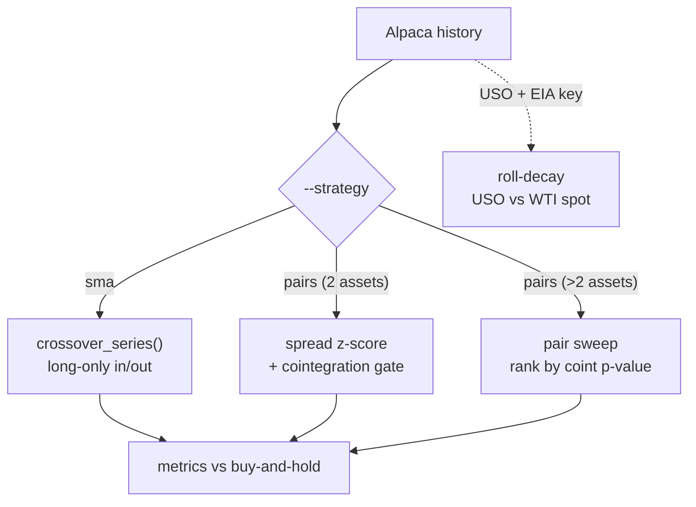

# Energy Batch Trader — Operations Runbook

Day-to-day operations, the strategy-research guide, the broker flows (Alpaca
paper → Robinhood live), and the Azure path.

## 1. Run it locally (Phase 1 — dry-run)

```bash
source .venv/bin/activate
python -m energy_trader -v
```

Dry-run computes signals, prints the orders it *would* place, and (if Telegram is
configured) sends an alert. Nothing is sent to a broker. This is the safe loop
for validating the strategy before any real money is involved.

## 2. Strategy research & backtesting

This is where you decide *whether a strategy is worth trading* before risking even
paper money. Everything here is read-only analysis.



### Backtest harness

```bash
python -m energy_trader --backtest                       # 3y, USO/XLE, SMA
python -m energy_trader --backtest --years 5 --asset USO
```

Reuses `strategy.crossover_series()` — the *same* rule the live job runs — so the
backtest can't drift from production. Reports total return, CAGR, Sharpe, max
drawdown, trade count, and win rate vs. buy-and-hold. numpy/pandas only.

> Backtests need **real bars** to mean anything: set `ALPACA_API_KEY` /
> `ALPACA_SECRET_KEY`. Without them the run uses synthetic data (proves the
> harness works, tells you nothing about the strategy).

### Strategies (`--strategy`)

**`sma`** (default) — long-only SMA crossover, the live signal.

**`carry`** — USO **roll-yield** signal (trailing USO-return − WTI-spot-return;
positive = backwardation). Prints SMA vs SMA-gated-by-carry vs buy-and-hold on one
window. Needs `USO` + `EIA_API_KEY`. *Verdict: a regime diagnostic, not an edge —
see Findings.*

**`voltgt`** — SMA **before/after volatility-targeted sizing** (Kaufman ch.23):
position scaled by `vol_target_annual / realized_vol` (capped at `vol_max_leverage`).
The drawdown-tamer that's now wired into live `analyze()`.

```bash
python -m energy_trader --backtest --strategy carry  --asset USO --plot
python -m energy_trader --backtest --strategy voltgt --asset USO --plot
```

`--plot` saves equity/drawdown, carry-regime, and vol-target mechanism PNGs to
`plots/` (known energy-shock windows shaded). `notebooks/research.ipynb` reproduces
the whole analysis with inline charts. Both are research-only (lazy matplotlib).

**`pairs`** — market-neutral spread mean reversion between two cointegrated
instruments. Computes a rolling hedge ratio (`beta`), z-scores the spread, and
trades extremes (`pairs_entry_z` in / `pairs_exit_z` out / `pairs_stop_z` bail).
Two reports diagnose the pair:
- **cointegration gate** — Engle-Granger p-value (needs `statsmodels`). `gate PASS`
  only when `p <= pairs_coint_max` (default 0.05). **Don't trade a `FAIL`.**
- **half-life** — Ornstein-Uhlenbeck reversion speed; you want days–weeks, not
  hundreds of days.

```bash
# Single pair (exactly 2 assets):
python -m energy_trader --backtest --strategy pairs --asset USO --asset XLE

# Sweep all pairs (3+ assets), ranked cointegrated-first:
python -m energy_trader --backtest --strategy pairs --years 5 \
  --asset XLE --asset VDE --asset IYE --asset XOM --asset CVX --asset USO
```

> **Reading a sweep:** a high return with `gate FAIL` is *not* alpha — it's the
> spread drifting (the pair isn't mean-reverting). Trust only `gate PASS` rows,
> then judge them on Sharpe/drawdown.

### USO roll-decay (contango) diagnostic

When USO is in the universe and `EIA_API_KEY` is set, the backtest prints USO's
return vs. WTI spot (EIA series `RWTC`). The gap is the roll (+fee) drag:
- **negative** ⇒ contango drag (USO bleeds vs. spot — the textbook case);
- **positive** ⇒ backwardation roll yield (USO beats spot).

It's a coarse empirical proxy (a total-return gap, not a pure roll decomposition),
but it stops you from assuming a contango drag that the current regime may have
reversed. You don't need CME contract specs for this — the gap *is* the effect.

### Findings so far (real data, split-adjusted — be honest)

> **The data bug that rewrote everything.** Raw Alpaca bars rendered USO's
> 2020-04-29 **1-for-8 reverse split** as a fake **+745%** day, inflating
> buy-and-hold ~8× and corrupting every earlier backtest. The pipeline now
> requests split/dividend-adjusted bars (`Adjustment.ALL` in `data.py`); the
> findings below are on clean data, and they **reverse** the original conclusions.

- **SMA trend-following BEATS buy-and-hold on USO** (10y clean): B&H +28% vs SMA
  10/50 **+80%** (Sharpe 0.36, MaxDD −49%), robust across windows — it works by
  dodging USO's contango drawdowns. (The old "SMA trails B&H" was the split bug.)
- **SMA trails B&H on XLE** (steady energy-equity uptrend) — expected.
- **USO roll regime is CONTANGO** (≈ −5%/yr, 10y): USO bled vs WTI spot, the
  textbook case. (The old "backwardation" reading was the split bug.)
- **Carry / roll-yield (`--strategy carry`) does NOT beat the SMA baseline** —
  neither standalone (−16%, −80% DD) nor as an SMA filter (over-vetoes or no-ops).
  It's a useful regime *diagnostic*, not a tradeable edge here.
- **Volatility targeting (`--strategy voltgt`) is the win** (Kaufman ch.23): on
  SMA(5/20) it cuts MaxDD ~−67%→−44% and lifts Sharpe ~0.31→0.38 while holding the
  return. Now **live** as entry sizing (`vol_target_live`).
- **USO/XLE still not cointegrated** (`gate FAIL`) — pairs unchanged.

### Tuning knobs (`config.py`)

`fast_window`/`slow_window` (SMA); `vol_target_annual`/`vol_window`/
`vol_max_leverage`/`vol_target_live` (vol sizing); `carry_window`/`carry_band`
(carry); `pairs_lookback`, `pairs_entry_z`, `pairs_exit_z`, `pairs_stop_z`,
`pairs_coint_max` (pairs); `eia_stock_z_threshold` (inventory gate). Match
`pairs_lookback`/z-thresholds to the pair's half-life.

### VectorBT (optional, research only)

For fast parameter sweeps, prototype in a notebook *outside* `dags/`:
`vbt.Portfolio.from_signals()`, then set the winners in `config.py`. Not a runtime
dependency of the daily job.

## 3. Telegram notifications

1. Message `@BotFather` → `/newbot` → copy the HTTP API token → `TELEGRAM_BOT_TOKEN`.
2. Send your bot `/start`, then hit
   `https://api.telegram.org/bot<TOKEN>/getUpdates` to find your `chat.id` →
   `TELEGRAM_CHAT_ID`.

Unset = notifications are silently skipped. Every run sends **one daily summary**
— the date, each asset's signal, and any orders — so you get a ping even on
all-hold days:

```
📊 EOD run (PAPER (alpaca)) — 2026-06-24
Signals: USO HOLD · XLE HOLD
No orders today (all hold).
```

(Plain text, not Markdown — trade reasons carry `$ ( ) · —` that Telegram's
Markdown parser rejects.)

## 4. Phase 2 — Alpaca paper trading (no real money)

Validate real fills with zero risk before any live broker.

1. **Get paper keys.** Alpaca dashboard → *Paper Trading* → generate an API
   key/secret. Put them in `.env` as `ALPACA_API_KEY` / `ALPACA_SECRET_KEY` (the
   same keys also fetch market data).
2. **Run it.** `python -m energy_trader --paper` (or set `EOD_BROKER=alpaca_paper`).
   Orders route to `paper-api.alpaca.markets`; nothing real is spent.
3. **Watch fills.** Orders appear in the Alpaca paper dashboard. A signal only
   fires on an actual SMA crossover, so quiet days place nothing.

## 5. Phase 3 — Going live (Robinhood Agentic Trading MCP)

Execution uses Robinhood's **official** MCP (`agent.robinhood.com/mcp/trading`),
not `robin_stocks`. The old SMS/TOTP MFA headache is gone — auth is OAuth.

1. **Open an Agentic account.** In the Robinhood app, start the Agentic Trading
   connector flow (desktop). Trades execute *only* in this isolated account.
2. **Fund it small.** Move in a deliberately small balance — that balance is the
   entire blast radius.
3. **Connect + get a token.** Approve the connector in the Robinhood app; export
   the issued token as `ROBINHOOD_MCP_TOKEN` in `.env`.
4. **Confirm the tool schema.** Before the first live order, list the server's
   tools and confirm the `place_equity_order` argument names, then adjust
   `RobinhoodMCPBroker._order_args` if they differ (it's flagged `TODO(live)`).
5. **Arm it.** `python -m energy_trader --live` (or `EOD_BROKER=robinhood`). Start
   with one asset and a tiny `default_notional`.

> Interactive sanity check: connect the same MCP to Claude Code / Claude Desktop
> and ask it to read your Agentic account — a quick way to confirm OAuth works
> before automating.

## 6. Deployment options (Phase 4)

**GitHub Actions (deployed — the cloud scheduler in use).**
`.github/workflows/eod-paper.yml` runs the pipeline on a cron with no server or
workstation kept on:
- Schedule `0 22 * * 1-5` — GitHub cron is **UTC only (no DST)**, so 22:00 UTC =
  6 PM EDT / 5 PM EST, both safely after the 4 PM ET close. Also `workflow_dispatch`
  for manual runs (`gh workflow run eod-paper.yml`).
- Installs the lean `requirements-runtime.txt` (no Airflow/viz) — installs in
  seconds. Runs `python -m energy_trader --paper`.
- Keys come from **repo secrets** (`gh secret set NAME`), not `.env`. Missing
  optional ones (EIA/Telegram) degrade gracefully.
- Caveats: not NYSE-holiday-aware (degrades to "hold"); GitHub disables scheduled
  workflows after **60 days** with no repo commits; cron can lag a few minutes.

Check runs: `gh run list --workflow=eod-paper.yml` → `gh run view <id> --log`.

**Airflow (kept as an option).** `export AIRFLOW_HOME=$(pwd)` so the `dags/`
folder is found; the DAG is a thin wrapper that calls `run_pipeline()`. The DAG's
`start_date` is tz-aware (`America/New_York`) so `0 18` means 6 PM ET, not UTC.
Heavy for one daily job — fine if you already run Airflow.

**Azure Functions (Phase 4 target).** A Timer-triggered function is the cheap
serverless fit. The function body is essentially:

```python
import azure.functions as func
from energy_trader import run_pipeline

def main(timer: func.TimerRequest) -> None:   # CRON e.g. "0 0 22 * * 1-5" (UTC)
    run_pipeline(dry_run=False)
```

Notes for the serverless move:
- **Secrets in Key Vault**, not `.env` — especially the OAuth refresh token.
  Functions are stateless/ephemeral, so do *not* rely on a local token cache.
- **Schedule in UTC.** 6 PM ET ≈ `22:00`/`23:00` UTC depending on DST.
- Use **Durable Functions** only if you later want per-step retries/fan-out;
  for a single daily pass a plain Timer trigger is enough.

## 7. Troubleshooting

- **`AlpacaNotConfigured`** — `--paper` without `ALPACA_API_KEY`/`SECRET_KEY` set.
- **`RobinhoodMCPNotConfigured`** — `ROBINHOOD_MCP_TOKEN` isn't set; you ran
  `--live` without finishing the connector flow. Use dry-run until it's set.
- **Pairs `gate n/a`** — `statsmodels` isn't installed (`pip install statsmodels`);
  the strategy still runs but can't compute the cointegration p-value.
- **No roll-decay line** — needs both `USO` in the universe and `EIA_API_KEY` set.
- **DAG not appearing** — `AIRFLOW_HOME` must point at the repo root (where
  `dags/` lives). The DAG adds the repo root to `sys.path` to import the package.
- **All HOLD every run** — expected with synthetic data (no Alpaca keys). Add
  Alpaca keys for real bars, or tune the SMA windows in `config.py`.
- **MCP order rejected** — likely a tool-argument mismatch; re-check step 5.4
  against the live `tools/list` schema.
